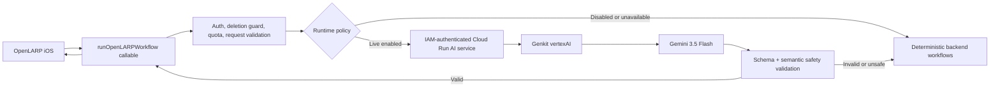

# Rich V0 Live AI Design

## Status

Approved for implementation on 2026-08-10.

This design covers the dependency-ordered backend slice that turns the existing authenticated Firebase callable into a live, server-side Genkit/Gemini path while preserving the deterministic OpenLARP loop. Adaptive onboarding UI, mission approval, and the full 14-day sprint remain subsequent pull requests that consume the contracts established here.

## Product Outcome

After a user approves their reviewed career understanding, the existing iOS flow can request a live Cooked diagnostic from Gemini through OpenLARP's server boundary. The same runtime can safely generate a quest plan, review text/link proof, and summarize progress. A provider failure, invalid model response, quota limit, disabled workflow, missing authentication, or unavailable service must leave the user on an honest deterministic path instead of creating a dead end.

## Non-Goals

- No TestFlight, App Store, signing, or release upload.
- No production-wide rollout or unauthenticated model endpoint.
- No direct provider call or provider credential in the iOS app.
- No RevenueCat, subscription, or paywall work.
- No image-byte transmission or claim that the model inspected an attachment in this slice.
- No autonomous action, job search/import, external messaging, or long-term memory write.
- No adaptive onboarding UI, mission UI, or 14-day sprint UI in this pull request.

## Verified Platform Decisions

- Use `genkit` and `@genkit-ai/google-genai` version `1.40.1`.
- Use the plugin's `vertexAI` namespace with Application Default Credentials; do not use an API key or downloaded service-account key in deployed environments.
- Default to the generally available `gemini-3.5-flash` model at the `global` location. The model ID remains backend-only and can be changed by validated backend configuration.
- Run the model process as an authenticated Cloud Run service. The service does not permit unauthenticated invocation. The Firebase Functions runtime service account is the intended `roles/run.invoker` principal.
- Use a Google-signed ID token whose audience is the Cloud Run service URL for service-to-service requests.
- Keep the existing Firebase callable as the only iOS-facing AI boundary so Firebase Auth, account-deletion guard, quota accounting, and future App Check enforcement remain authoritative.

The current Genkit dependency tree retains high-severity transitive advisories without an upstream fix. Controlled beta use is permitted only with the isolation and runtime controls below. The audit result is a release gate, not hidden or relabeled as clean.

## Architecture

### Component boundaries

1. `backend/ai` owns shared schemas, prompt construction, live generation, output validation, deterministic fallback, evaluation fixtures, and privacy-safe run metadata.
2. `backend/ai-service` owns the minimal HTTP process used by Cloud Run. It accepts one internal request shape, limits body size, delegates to `backend/ai`, and exposes only `/healthz` and `/v1/workflows:run`.
3. `backend/functions` remains Genkit-free. It owns Firebase authentication, user quota, account-deletion rejection, runtime-policy lookup, budget reservation, IAM-authenticated dispatch to Cloud Run, and deterministic fallback when the live service cannot produce an accepted result.
4. iOS continues to call `runOpenLARPWorkflow`; no provider SDK, model ID, service URL, token count, cost, or internal failure detail crosses into app contracts.

## Supported Workflows

This slice enables live generation for the four workflows already consumed by iOS:

- `cookedDiagnostic`
- `questPlan`
- `proofQualityCheck`
- `progressSummary`

It also defines an `adaptiveCareerIntake` request and response contract for the next onboarding pull request. That workflow returns either one focused follow-up question, one explicitly unconfirmed hypothesis, or a completion signal. It cannot approve facts or mutate durable user state.

Future workflows already present in the package stay deterministic and disabled for live dispatch until their product surfaces are implemented.

## Internal Request And Response

The Firebase edge sends an internal envelope containing:

- schema version;
- workflow kind;
- client request ID;
- sanitized typed workflow payload;
- immutable safety rules;
- privacy flags;
- runtime-policy revision;
- maximum output tokens.

It does not contain Firebase UID, email, authentication token, account identifier, local file path, attachment name, provider credential, or arbitrary client headers.

The AI service returns:

- schema version;
- request ID and workflow kind for correlation;
- validated workflow result;
- whether a live model produced the accepted result;
- a bounded failure category when deterministic fallback was required;
- usage metadata containing integer input, output, and total token counts;
- elapsed milliseconds and runtime-policy revision.

Provider exception text, prompt text, proof text, model output before validation, and model ID are not returned to iOS or persisted in user documents.

## Live Generation

Each workflow uses a dedicated system instruction and typed output schema. Genkit structured output is necessary but not sufficient: the returned value is parsed again with the shared Zod schema and then passed through OpenLARP semantic validators.

Generation settings are bounded and backend-owned:

- temperature `0.2`;
- one candidate;
- per-workflow maximum output token count capped by the global configured maximum;
- no tools, code execution, URL retrieval, search grounding, or external actions;
- no prompt-provided model selection;
- no client-provided system instruction.

Prompt construction labels confirmed facts, unknowns, self-report, and proof separately. The prompt must never tell the model to infer missing employers, schools, credentials, titles, dates, projects, outcomes, or ownership.

## Safety And Honesty

The post-generation validator rejects output that:

- invents or presents as known an employer, school, credential, job title, date, project, ownership claim, result, or outcome absent from confirmed input;
- claims attachment or image inspection when the workflow received metadata only;
- turns self-report into verified proof;
- requests an external action;
- writes or claims to write long-term memory;
- omits required uncertainty for unknown facts;
- returns non-finite, out-of-range, or internally inconsistent scoring;
- generates a quest whose definition of done requires fabrication, impersonation, spam, or an inaccessible paid resource.

Proof feedback must state its evidence boundary. Text and link strings may be evaluated as user-provided content, but a link target is not fetched and attachment bytes are not inspected in this slice.

## Runtime Policy, Quotas, Budgets, And Kill Switches

Two independent gates control live use:

1. `OPENLARP_ENABLE_LIVE_AI=true` is the master deployment gate. Any other value forces deterministic execution.
2. A cached Firestore runtime-policy document can disable all live AI or individual workflow kinds without a deploy. Missing, malformed, stale beyond the allowed cache window after a refresh failure, or explicitly disabled policy fails closed to deterministic execution.

The Firebase edge applies its existing per-user daily quota before dispatch. It reserves estimated daily budget before calling Cloud Run and reconciles that reservation with returned usage. A request that would exceed the configured daily provider budget does not call the live service.

The Cloud Run service independently enforces request size, timeout, concurrency, and maximum output tokens. Deployment guidance fixes `min-instances=0`, a bounded `max-instances`, and no unauthenticated invoker.

## Fallback Semantics

Deterministic fallback is an accepted product path, not a fabricated live response.

Fallback occurs when:

- the master or workflow kill switch is off;
- runtime policy cannot be trusted;
- live budget or user quota is exhausted;
- Cloud Run authentication or network dispatch fails;
- the service times out;
- Gemini refuses or fails generation;
- output is missing, malformed, schema-invalid, unsafe, or semantically unsupported.

The callable returns the deterministic result with `liveModelUsed=false`, `usedFallback=true`, and a safe category such as `disabled`, `quota`, `budget`, `timeout`, `provider`, `invalid-output`, or `unsafe-output`. The app remains usable and must not present the fallback as a live inspection.

Authentication-required and malformed client requests remain errors; they are not converted into model fallbacks because doing so would bypass the existing account and contract boundaries.

## Observability And Data Retention

Structured operational events may include:

- request ID;
- workflow kind;
- runtime-policy revision;
- live/fallback outcome and safe category;
- schema/safety validation result;
- elapsed milliseconds;
- input/output/total token counts;
- estimated cost micros;
- retry count;
- HTTP status class.

They must not include UID, email, prompt, answer, proof text, link, attachment path/name, career facts, generated result text, provider exception text, or bearer token. The model ID is allowed only in deployment-level configuration logs, never per-user application events or client responses.

## Dependency-Risk Containment

- Genkit dependencies exist only in `backend/ai` and `backend/ai-service`, never `backend/functions` or iOS.
- The AI service exposes no Genkit developer UI, flow server, Prometheus listener, Jaeger propagation endpoint, arbitrary trace-header forwarding, or debug route.
- Cloud Run IAM rejects unauthenticated requests before the container handles them.
- The Functions dispatcher forwards an allowlisted JSON body and does not forward client headers.
- Request bodies are capped at 256 KiB and parsed once.
- CI runs a production dependency audit and records the known residual count. A critical advisory or a newly introduced directly exploitable high advisory fails the release gate.
- Broad production rollout remains prohibited while the residual advisories are unresolved; this design authorizes controlled development-beta verification only.

## Deployment And Local Development

Repository changes include a production Dockerfile and documented `gcloud` commands, but this pull request does not deploy automatically.

Deployment requires:

- a dedicated runtime service account with only Vertex/Agent Platform invocation and logging permissions;
- a Firebase Functions runtime identity granted `roles/run.invoker` on the AI service;
- Cloud Run authentication enabled with no public invoker;
- the Cloud Run URL configured in Functions environment/secrets without committing it;
- Vertex/Agent Platform API and billing enabled in the development project;
- a validated runtime-policy document and explicit live-AI master flag.

Local tests inject an in-process live generator or HTTP transport. An opt-in live smoke command uses Application Default Credentials and a designated development project, redacts response content, spends at most one request, and is never part of ordinary CI.

## Verification

Automated verification must prove:

- every request/response schema rejects malformed, oversized, or mismatched data;
- each live workflow calls the wished-for generator interface and revalidates output;
- each failure category returns the correct deterministic result and audit flags;
- fabrication, unsupported proof-inspection, external-action, and long-term-memory red-team fixtures are rejected;
- runtime policy fails closed and kill switches prevent live dispatch;
- per-user quota and provider budget checks run before dispatch;
- token/cost metadata is nonnegative, bounded, and excluded from iOS payloads;
- logs contain no fixture secrets or private career/proof text;
- the HTTP service rejects wrong methods, paths, content types, oversized bodies, and invalid envelopes;
- the Functions dispatcher uses an ID-token client with the Cloud Run URL as audience and does not forward client headers;
- deterministic backend, Firebase Rules emulators, repository safety, iOS build/tests, and release-contract CI remain green.

Live-development verification must prove one credentialed `cookedDiagnostic` request reaches the configured Gemini model, returns schema-valid output, records safe usage metadata, and can be forced back to deterministic behavior by the kill switch. The command must print only status, workflow kind, token counts, latency, and validation outcome.

## Acceptance Criteria

This slice is complete when:

1. The final PR head is green in CI and independently reviewed.
2. The callable uses live Gemini for an enabled authenticated development-beta request and deterministic fallback for every defined unavailable case.
3. No iOS bundle or repository file contains a provider key, service-account key, model credential, or Cloud Run bearer token.
4. No unsafe or schema-invalid model output reaches the app.
5. The app remains functional with live AI completely disabled.
6. Documentation accurately distinguishes implemented code, verified live development state, residual dependency risk, and undeployed configuration work.
